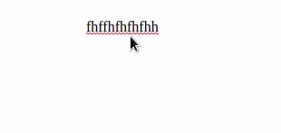

# Font Color Tool

Font Color Tool for coloring text-fragments for the [Editor.js](https://editorjs.io).



## Installation

### Install via NPM *TODO

Get the package

```shell
npm i --save-dev @editorjs/font-color
```

Include module at your application

```javascript
const FontColor = require('@editorjs/font-color');
```

### Download to your project's source dir

1. Upload folder `dist` from repository
2. Add `dist/bundle.js` file to your page.


## Usage

Add a new Tool to the `tools` property of the Editor.js initial config.

```javascript
const editor = EditorJS({
  ...
  
  tools: {
    ...
    FontColor: {
      class: FontColor,
      config: {
        colors: [
          '#009900',
          '#990000',
          '#000099',
          '#000000',
        ],
        columnsCount: 4,
        colorButton: {
          width: 24,
          height: 24,
          spacingX: 8,
          spacingY: 8,
          borderRadius: '100%'
        }
      }
    }
  },
  
  ...
});
```

## Config Params

Font Color tool supports these configuration parameters:

| Field                      | Type        | Default                                       | Description                                           |
| ---------------------------|-------------|-----------------------------------------------|-------------------------------------------------------|
| colors                     | `string[]`  | ['#009900', '#990000', '#000099', '#000000']  | Available hex colors to choose from in popup          |
| columnsCount               | `int`       | 4                                             | Number of columns in colors popup                     |
| colorButton.border         | `string`    | 'none'                                        | Value of CSS border property                          |
| colorButton.borderRadius   | `string`    | '100%'                                        | Value of CSS border-radius property                   |
| colorButton.spacingX       | `int`       | 8                                             | Horizontal space between colors in popup in pixels    |
| colorButton.spacingY       | `int`       | 8                                             | Vertical space between colors in popup in pixels      |
| colorButton.width          | `int`       | 24                                            | Width of color button in popup in pixels              |
| colorButton.height         | `int`       | 24                                            | Height of color button in popup in pixels             |
| noColorButton.border       | `string`    | '1px solid #e4e5e9'                           | Value of CSS border propery for button removing color |

Button for removing color inherits CSS from color button. So if you set `noColorButton.border` to `undefined`, `colorButton.border` will be used insted.


## Output data

Colored text will be wrapped in a `span` tag with two classes: 1) `cdx-font-color` 2) `cdx-font-color_hash<color>`, where color is a hex color string without `#`.

```json
{
    "type" : "text",
    "data" : {
        "text" : "Create a directory for your module, enter it and run <span class=\"cdx-font-color cdx-font-color_hash990000\">npm init</span> command."
    }
}
```

